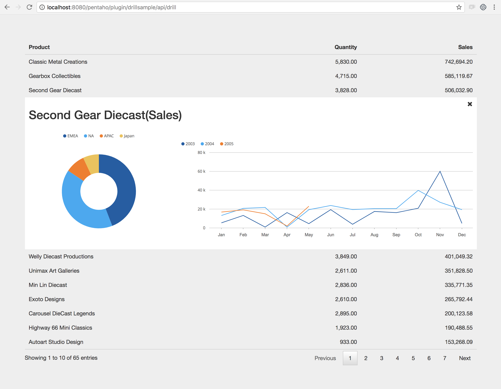

drillsample
===

Pentaho plugin with a sample dashboard showing how to imlpement drill down on a TableComponent.

Sample features:

* Table styling;
* Drill down on a Table Component
* Dashboard component - a (mini) dashboard embedded into another using parameters;
* Table component (Datatables) expanded container being closed with a button;



# Dependencies

* Only tested in Pentaho Server 8.x;
* SteelWheels Sales sample data source.
* git (only if you want to clone)

# Deploy

```bash
cd YOUR_PENTAHO_FOLDER/pentaho-server/pentaho-solutions/system/
git clone https://github.com/oncase/drillsample.git
```

 - Restart your Pentaho Server
 - Navigate to http://localhost:8080/pentaho/plugins/drillsample/api/drill